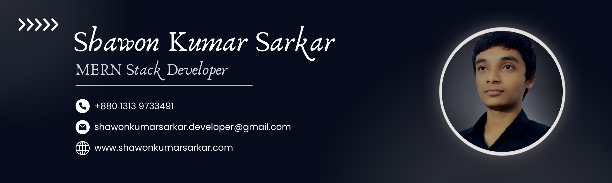

<!-- Introduction -->

<h1>
  <samp>
    😃 Hey there!, I'm
    <b><a target="_blank" href="https://www.youtube.com">Shawon Kumar Sarkar</a></b>
  </samp>
</h1>

<picture>
  <source media="(prefers-color-scheme: dark)" srcset="./assets/Profile-Cover-Dark.png">
  <source media="(prefers-color-scheme: light)" srcset="./assets/Profile-Cover-Light.png">
  
</picture>

 

**I am a passionate and dedicated MERN stack developer with 1 year of experience building dynamic and responsive web applications. With a strong grasp of MongoDB, Express.js, React, and Node.js, I specialize in creating user-friendly interfaces and scalable backend solutions. My goal is to deliver innovative web solutions that enhance user experiences and meet client needs effectively.**

<!--
**Shawon-Kumar-Sarkar/Shawon-Kumar-Sarkar** is a ✨ _special_ ✨ repository because its `README.md` (this file) appears on your GitHub profile.

Here are some ideas to get you started:

- 🔭 I’m currently working on ...
- 🌱 I’m currently learning ...
- 👯 I’m looking to collaborate on ...
- 🤔 I’m looking for help with ...
- 💬 Ask me about ...
- 📫 How to reach me: ...
- 😄 Pronouns: ...
- ⚡ Fun fact: ...
-->
